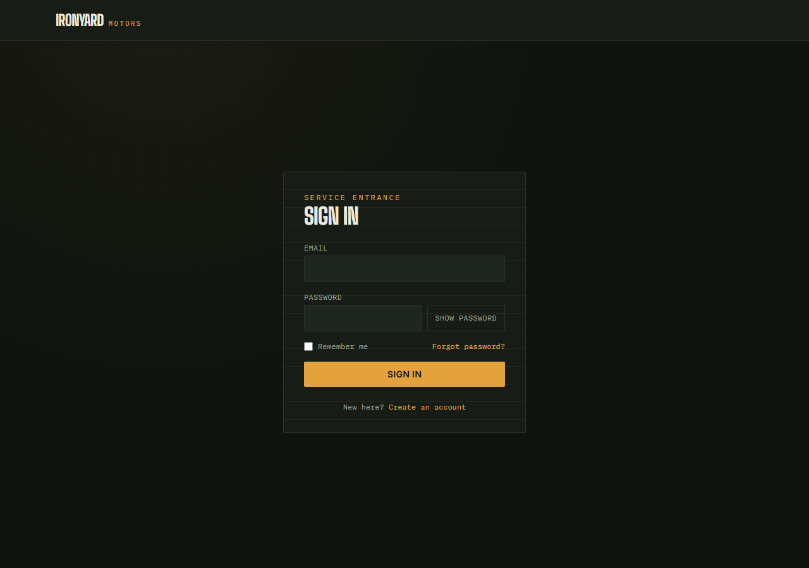
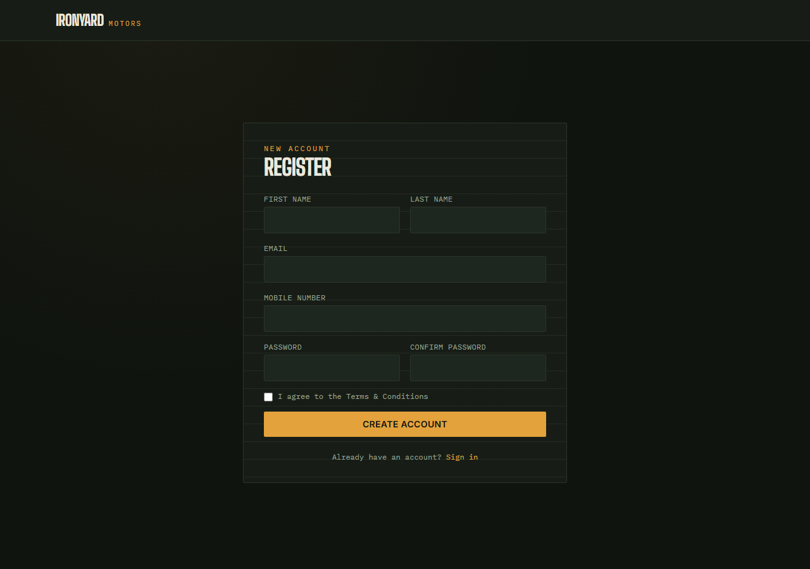
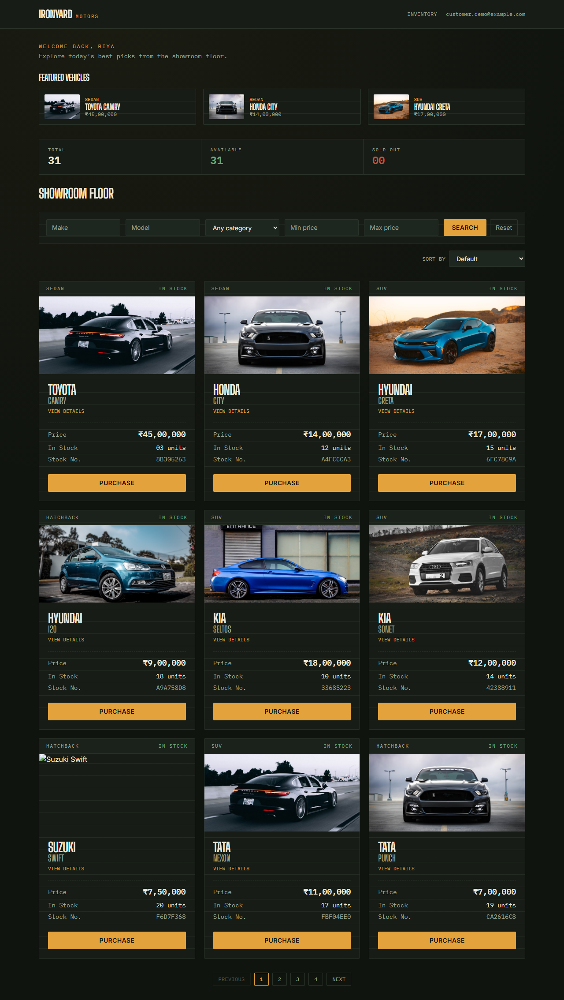
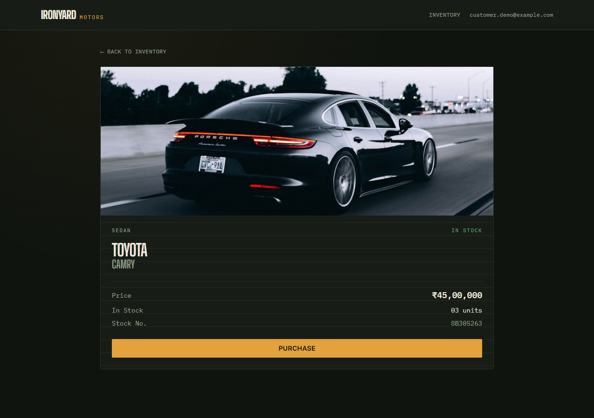
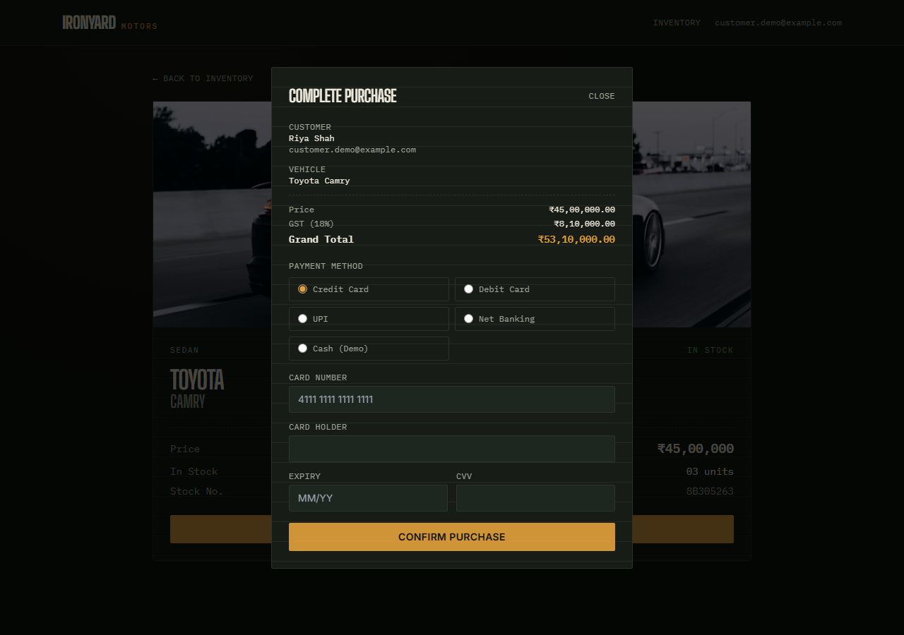
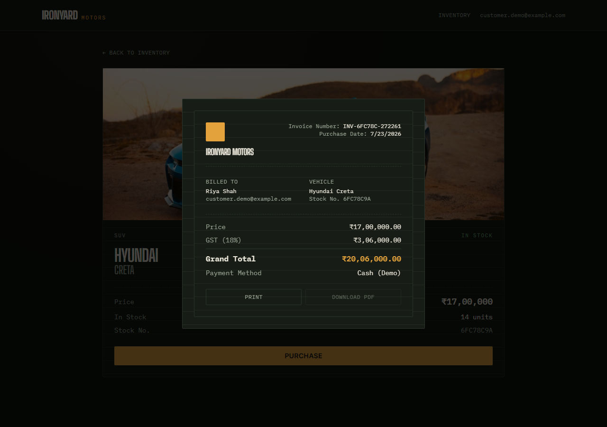
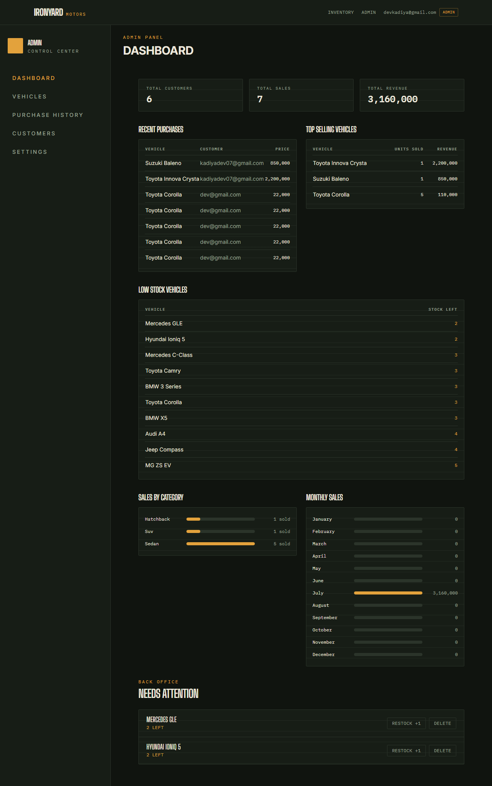
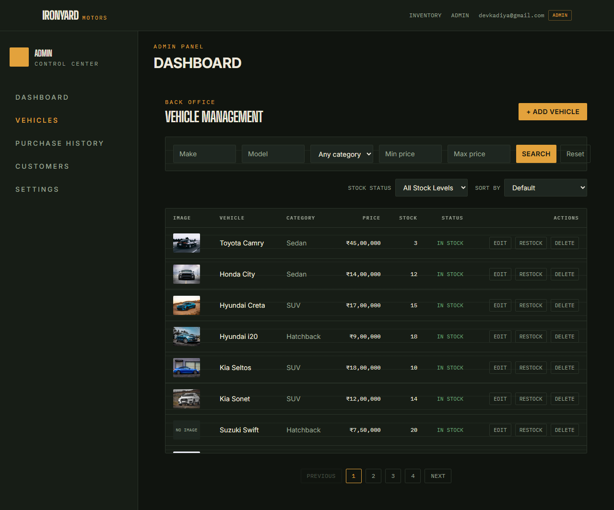
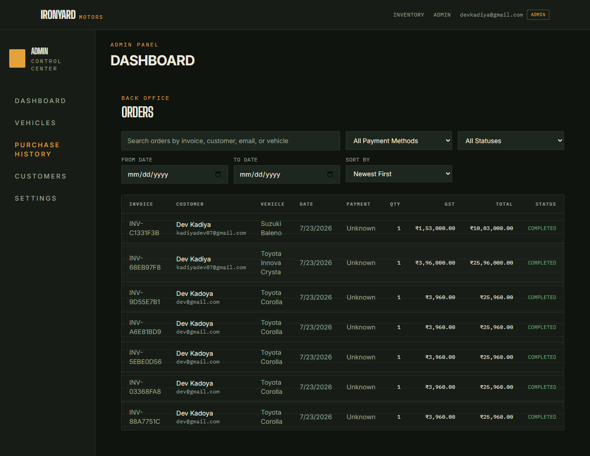
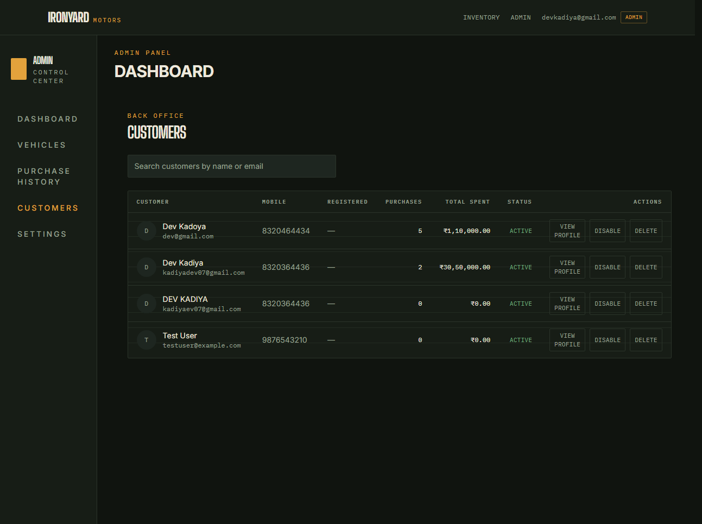

# Ironyard Motors — Car Dealership Inventory System

A full-stack car dealership inventory and sales platform built as a strict **Test-Driven Development (TDD)** kata: FastAPI + PostgreSQL on the backend, React + Vite + Tailwind on the frontend. Customers browse and purchase vehicles; admins manage inventory, customers, orders, and view sales analytics.

Every feature in this repository was built Red → Green → Refactor, with a matching commit for each step. See [`PROMPTS.md`](./PROMPTS.md) for the full AI-assisted development log.

---

> **Quick look, no setup:** demo login credentials are in [Demo accounts](#5-demo-accounts) below.

## Table of Contents

- [Project Overview](#project-overview)
- [Tech Stack](#tech-stack)
- [Architecture](#architecture)
- [Getting Started](#getting-started)
- [API Reference](#api-reference)
- [Screenshots](#screenshots)
- [Test Report](#test-report)
- [My AI Usage](#my-ai-usage)
- [Project Structure](#project-structure)

---

## Project Overview

Ironyard Motors is a two-sided application:

- **Customers** register, log in, browse the vehicle showroom (search/filter/sort/paginate), view a vehicle's detail page, and purchase it through a modal that computes GST live and generates a printable invoice.
- **Admins** get a separate `/admin/*` area:The application includes a dedicated **Admin Dashboard** that provides real-time business insights and management tools. After logging in with an administrator account, click the **ADMIN** button in the navigation bar to access the dashboard. A dashboard with live sales analytics (revenue, top sellers, low stock, sales by category, monthly trend, orders by status/payment method), full vehicle inventory CRUD, customer management (search, enable/disable, delete, profile drill-down), and an order management screen with search/filter/sort/pagination that reuses the same invoice component customers see.

Everything is backed by a real PostgreSQL database (via Docker), JWT authentication, and role-based access control (`customer` / `admin`).

## Tech Stack

| Layer | Choice |
|---|---|
| Backend | Python, FastAPI, SQLAlchemy 2.0, Pydantic v2 |
| Database | PostgreSQL 16 (Dockerized), Alembic migrations |
| Auth | JWT (python-jose), bcrypt password hashing |
| Backend tests | pytest, pytest-cov, httpx (70 tests, 95% coverage) |
| Frontend | React 18, Vite, React Router v6, Tailwind CSS, Axios |
| Frontend tests | Vitest, React Testing Library (134 tests) |

## Architecture

The backend follows a layered **router → service → repository** pattern:

- **Routers** (`app/routers/`) handle HTTP concerns only — request/response models, status codes, auth dependencies.
- **Services** (`app/services/`) hold business logic (e.g. rejecting a purchase when stock is insufficient).
- **Repositories** (`app/repositories/`) are the only layer that talks to SQLAlchemy/the database.

This keeps business rules testable without spinning up a database in every test, and keeps routers thin.

The frontend mirrors this separation: `api/` (thin Axios wrappers per resource), `hooks/` (`useAsyncList`, `usePagination`, `useAuth`, `useDashboard` — shared stateful logic extracted once duplicated across 2+ pages), `components/` (reusable UI: `Modal`, `Table`, `Pagination`, `Invoice`), and `pages/` (screen composition).

## Getting Started

### Prerequisites

- Python 3.12+
- Node.js 18+
- Docker (for PostgreSQL)

### 1. Database

```bash
docker-compose up -d
```

This starts PostgreSQL on `localhost:5433` (remapped from the default 5432 to avoid clashing with a local Postgres install) with the credentials already wired into the backend's default config.

### 2. Backend

```bash
cd backend
python -m venv venv
./venv/Scripts/activate        # Windows: venv\Scripts\activate
pip install -r requirements.txt

# Apply the schema
alembic upgrade head

# Run the API
uvicorn app.main:app --reload --port 8000
```

The API is now live at `http://localhost:8000` (interactive docs at `/docs`).

Configuration is via environment variables (see `app/config.py`); sensible local defaults are baked in, so no `.env` is required to run against the Dockerized database above.

### 3. Frontend

```bash
cd frontend
npm install
npm run dev
```

The app is now live at `http://localhost:5173`.

### 4. Running the tests

```bash
# Backend
cd backend && python -m pytest

# Frontend
cd frontend && npm test
```

### 5. Demo accounts

For reviewers who just want to click around without registering:

| Role | Email | Password |
|---|---|---|
| Admin | `devkadiya@gmail.com` | `Craftsman1` |
| Customer | `customer.demo@example.com` | `Demo1234` |

Log in with the admin account and visit `/admin/dashboard` to see the full back office (inventory, customers, orders, analytics, settings).

To promote any other registered account to admin manually:

```sql
UPDATE users SET role = 'ADMIN' WHERE email = 'your@email.com';
```

## API Reference

All endpoints except register/login require a `Bearer <token>` JWT. Admin-only endpoints are marked.

| Method | Endpoint | Description |
|---|---|---|
| POST | `/api/auth/register` | Register a new customer |
| POST | `/api/auth/login` | Log in, returns a JWT |
| GET | `/api/vehicles` | List all vehicles |
| GET | `/api/vehicles/search` | Search by make/model/category/price range |
| GET | `/api/vehicles/{id}` | Get a single vehicle |
| POST | `/api/vehicles` | Add a vehicle |
| PUT | `/api/vehicles/{id}` | Update a vehicle |
| DELETE | `/api/vehicles/{id}` | Delete a vehicle **(admin)** |
| POST | `/api/vehicles/{id}/purchase` | Purchase a vehicle (decrements stock) |
| POST | `/api/vehicles/{id}/restock` | Restock a vehicle **(admin)** |
| GET | `/api/purchases/me` | Current user's purchase history |
| GET | `/api/purchases` | All purchases, with customer/vehicle detail **(admin)** |
| GET | `/api/customers` | List customers, with purchase totals **(admin)** |
| PATCH | `/api/customers/{id}/status` | Enable/disable a customer **(admin)** |
| DELETE | `/api/customers/{id}` | Delete a customer **(admin)** |
| GET | `/api/dashboard/summary` | Totals: customers, vehicles, sales, revenue **(admin)** |
| GET | `/api/dashboard/recent-purchases` | Latest 10 purchases **(admin)** |
| GET | `/api/dashboard/top-selling` | Top vehicles by revenue **(admin)** |
| GET | `/api/dashboard/low-stock` | Vehicles at ≤5 units **(admin)** |
| GET | `/api/dashboard/sales-by-category` | Units/revenue per category **(admin)** |
| GET | `/api/dashboard/monthly-sales` | 12-month revenue trend **(admin)** |
| GET | `/api/dashboard/orders-by-status` | Order counts by status **(admin)** |
| GET | `/api/dashboard/orders-by-payment-method` | Order counts by payment method **(admin)** |

## Screenshots

### Customer Experience

**Login**


**Register**


**Showroom floor — search, filter, sort, pagination**


**Vehicle detail**


**Purchase modal — live GST calculation, payment method**


**Purchase confirmation → invoice**


### Admin Experience

**Admin dashboard — analytics**


**Inventory management**


**Order management — reuses the customer invoice component**


**Customer management**


## Test Report

Both suites are green as of the latest commit.

```
Backend  (pytest):    70 passed, 0 failed  — 95% line coverage
Frontend (vitest):    134 passed, 0 failed — 19 test files
```

Run `pytest` / `npm test` locally to reproduce (see [Getting Started](#getting-started)).

Every feature was built test-first — a failing test committed before the implementation that makes it pass (`git log --oneline` shows the `test:` → `feat:` → `refactor:` rhythm throughout the project's history).

## My AI Usage

This project was built in close collaboration with **Claude Code** (Anthropic), used as an active pair-programmer across the entire lifecycle rather than as a one-off autocomplete tool. A full, unedited log of the prompts used is in [`PROMPTS.md`](./PROMPTS.md); this section is the reflection.

**How I used it:**

- **Feature specs → TDD cycles.** For each feature (auth, vehicle inventory, purchases, admin dashboard, customer management, order management, analytics), I wrote a detailed prompt specifying requirements, reuse constraints ("never duplicate existing functionality"), and the exact Red→Green→Refactor process to follow, including what a commit message should look like at each step. Claude wrote the failing test first, ran it to confirm it failed for the right reason, implemented the minimum to pass, reran the suite, then looked for genuine duplication to extract — never speculative abstractions.
- **Debugging real infrastructure issues.** Several bugs only existed in the *live* running app, not the mocked test suite — e.g. a Postgres port mismatch, a CSS stacking-context bug that broke a modal's click target, and a schema drift issue where `Base.metadata.create_all()` silently failed to add new columns to existing tables. I had Claude reproduce these with a real browser (Playwright) against the running dev servers rather than trust green tests alone, since the automated suite mocks the API layer.
- **Code review and refactor judgment.** After each feature, I asked it to look for genuine duplication (not to refactor reflexively) — this produced real extractions like a shared `useAsyncList` hook and a shared `usePagination` hook only once the same pattern appeared independently in 3 different admin pages, not preemptively.
- **Housekeeping.** Auditing the working tree for uncommitted or unused files, restoring a missing root `.gitignore`, and generating this documentation.

**Reflection:** The highest-leverage use of AI here wasn't code generation — it was using it to *enforce discipline* I'd otherwise skip under time pressure: writing the failing test first every time, verifying claims against a live browser instead of trusting mocks, and treating "add a route" as a full RED→GREEN cycle even when it felt trivial. The main risk I had to actively manage was scope drift — a capable assistant will happily build more than was asked, so specs needed to be explicit about what *not* to build, and I used its clarifying-question capability (rather than letting it guess) at genuine ambiguity points, like what "Admin Settings" should actually contain.

## Project Structure

```
backend/
  app/
    auth/          # JWT + password hashing
    models/        # SQLAlchemy models
    repositories/   # DB access layer
    routers/        # FastAPI route handlers
    schemas/        # Pydantic request/response models
    services/       # Business logic
  alembic/          # DB migrations
  tests/            # pytest suite

frontend/
  src/
    api/            # Axios wrappers per resource
    components/     # Reusable UI (Modal, Table, Pagination, Invoice, ...)
    hooks/          # Shared stateful logic (useAsyncList, usePagination, ...)
    pages/          # Route-level screens (customer + admin)
    utils/          # Formatting/sorting/validation helpers

screenshots/        # App screenshots referenced above
docker-compose.yml  # PostgreSQL for local dev
PROMPTS.md          # Full AI prompt log
```
